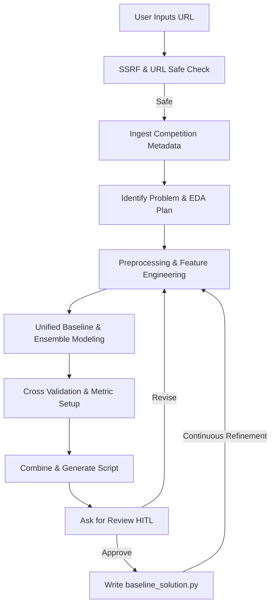

# Kaggle Copilot Agent

An AI assistant that automatically decomposes a Kaggle competition description or URL into a functional, validated machine learning baseline solution. Built with Google Agent Development Kit (ADK) 2.0.

## Overview

The Kaggle Copilot accepts a Kaggle competition link, extracts context using a custom metadata scraping tool, analyses features, plans data preprocessing, designs machine learning pipelines, and evaluates candidates under target-leakage-protected splits. The agent focuses on generating highly performant scripts that directly ingest competition data and favor state-of-the-art models like LightGBM and XGBoost.

---

## 🏗️ Architecture



### Key Workflow Features:
1.  **Streamlit Chat Interface**: A custom, polished UI featuring a ChatGPT-like sidebar for managing persistent conversation histories (`conversations.json`) across sessions.
2.  **Dynamic Graph Workflow**: Implemented as an asynchronous ADK dynamic flow, preserving loop checkpointing and variable scopes natively to support Human-in-the-loop (HITL) interactions and **continuous post-generation refinement**.
3.  **Real-World Data Processing**: The generated script is structured to directly load the competition's `train.csv` and `test.csv` using pandas, producing executable, competition-ready code without relying on synthetic data.
4.  **Targeted Web Research**: Features an internally decoupled modeling node that transparently leverages `google_search` to research state-of-the-art baselines (prioritizing Gradient Boosting libraries) before generating structured code.
5.  **Robust Feature Engineering & Ensembling**: The workflow dedicates specific steps to domain-aware feature engineering and automatically constructs powerful model ensembles (e.g., Voting, Stacking) directly based on research.

---

## 📁 Project Structure

```
kaggle-copilot/
├── app/                      # Core agent code
│   └── agent.py              # Main agent workflow logic & tools
├── streamlit_app.py          # Custom Streamlit Chat Frontend
├── conversations.json        # Persistent chat history storage
├── .env                      # Local environment configurations
├── pyproject.toml            # Project dependencies
└── README.md                 # Project guide
```

---

## ⚙️ Requirements & Installation

1. **uv**: Ensure Astral's Python manager `uv` is installed ([Install Guide](https://docs.astral.sh/uv/getting-started/installation/)).
2. **agents-cli**: Install via `uv tool install google-agents-cli`.
3. Configure the `.env` file at the root directory:
   ```env
   GOOGLE_CLOUD_PROJECT=your-gcp-project-id
   GOOGLE_CLOUD_LOCATION=global
   GOOGLE_GENAI_USE_VERTEXAI=True
   ```

Install project dependencies:
```bash
agents-cli install
```

---

## 🚀 Running the Agent

Start the local Streamlit application:
```bash
uv run streamlit run streamlit_app.py
```

1. Open the local web interface link shown in the terminal (usually `http://localhost:8501`).
2. Provide a Kaggle URL (e.g., `https://www.kaggle.com/competitions/titanic`) in the chat to begin.
3. The agent will fetch the metadata, plan preprocessing, research models, and generate the final code.
4. When prompted by the agent, either reply with `approve` to finalize and write the script, or provide feedback (e.g., "Use XGBoost instead") to trigger a revision loop.
5. You can seamlessly switch between past projects using the **Past Conversations** menu in the sidebar!
