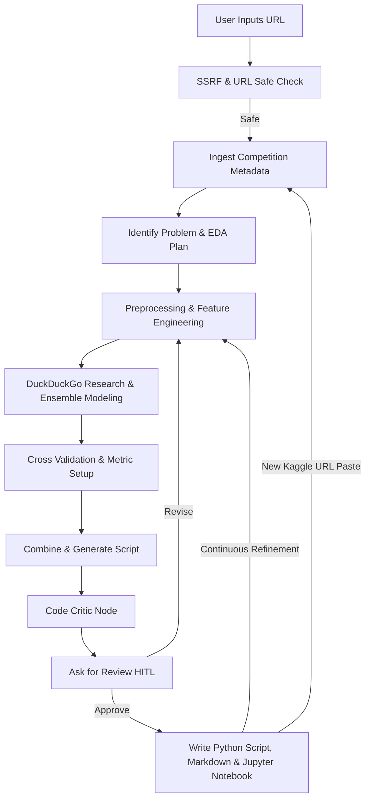

# Kaggle Copilot Agent

An autonomous AI assistant that decomposes a Kaggle competition description or URL into a functional, validated machine learning baseline solution. Built with Google Agent Development Kit (ADK) 2.0.

## Overview

The Kaggle Copilot provides a true **"Zero-Click"** experience. It accepts a Kaggle competition link, instantly extracts context using metadata scraping, plans data preprocessing, designs machine learning pipelines, and evaluates candidates under target-leakage-protected splits. The agent focuses on generating highly performant scripts that favor state-of-the-art models like LightGBM and XGBoost, without ever requiring you to download the dataset beforehand or configure complex Kaggle API keys.

---

## 🏗️ Architecture



### Key Workflow Features:
1.  **Zero-Click Experience**: Instantly transitions from URL ingestion to code generation. The agents use standardized placeholders (e.g., `pd.read_csv('train.csv')`) so you don't need to authenticate or download the dataset in advance.
2.  **Streamlit Chat Interface**: A custom, polished UI featuring a ChatGPT-like sidebar for managing persistent conversation histories (`conversations.json`), alongside one-click buttons to Clear LLM Cache and Delete All Conversations.
3.  **Observability & Telemetry**: Every intermediate agent output and exact token consumption (In/Out) is rendered in beautifully formatted, persistent UI expanders that survive page reloads.
4.  **Deterministic LLM Caching**: Built-in MD5 state hashing mechanism automatically bypasses expensive LLM API calls if the underlying `KaggleState` has not changed, saving time and tokens.
5.  **Smart Routing & Persistent Memory**: Post-workflow, the orchestrator detects if a user pastes a new Kaggle URL (wiping the state and restarting gracefully) or types a natural language request. Human feedback is appended to a persistent list, ensuring the model never suffers from "amnesia" during sequential refinement loops.
6.  **Code Critic Reviewer**: An independent "Grandmaster" agent critiques the generated code for data leakage and common pitfalls before presenting it to the user.

---

## 📁 Project Structure

```text
kaggle-copilot/
├── app/                        # Modular Agent Package
│   ├── __init__.py             # Exposes the ADK App
│   ├── schema.py               # Pydantic State definitions
│   ├── utils.py                # Pure helper functions (Caching & State mapping)
│   ├── tools.py                # Web search and scraping tools
│   ├── agents.py               # LLM Agent definitions and prompts
│   ├── nodes.py                # Deterministic I/O and interactive ADK nodes
│   └── workflow.py             # Main ADK state machine orchestrator
├── streamlit_app.py            # Custom Streamlit Chat Frontend
├── conversations.json          # Persistent chat history storage
├── .env                        # Local environment configurations
├── pyproject.toml              # Project dependencies
└── README.md                   # Project guide
```

---

## ⚙️ Requirements & Installation

1. **uv**: Ensure Astral's Python manager `uv` is installed ([Install Guide](https://docs.astral.sh/uv/getting-started/installation/)).
2. Configure the `.env` file at the root directory:
   ```env
   GOOGLE_CLOUD_PROJECT=your-gcp-project-id
   GOOGLE_CLOUD_LOCATION=global
   GOOGLE_GENAI_USE_VERTEXAI=True
   ```

Install project dependencies:
```bash
uv sync
```

---

## 🚀 Running the Agent

Start the local Streamlit application:
```bash
uv run streamlit run streamlit_app.py
```

1. Open the local web interface link shown in the terminal (usually `http://localhost:8501`).
2. Provide a Kaggle URL (e.g., `https://www.kaggle.com/competitions/digit-recognizer`) in the chat to begin.
3. The agent will fetch the metadata, research models, and generate the final code instantly.
4. When prompted by the agent, either reply with `approve` to finalize and save the files, or provide feedback (e.g., "Use XGBoost instead") to trigger a revision loop. Your feedback is accumulated so the agent remembers past instructions!
5. To start a new project, simply paste a new Kaggle URL in the chat, or use the **Start New Conversation** button in the sidebar.
