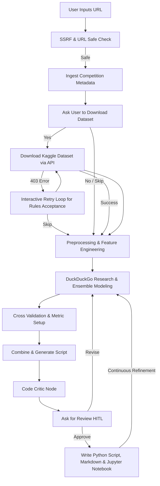

# Kaggle Copilot Agent

An autonomous AI assistant that decomposes a Kaggle competition description or URL into a functional, validated machine learning baseline solution. Built with Google Agent Development Kit (ADK) 2.0.

## Overview

The Kaggle Copilot accepts a Kaggle competition link, automatically downloads the dataset, extracts context using metadata scraping, plans data preprocessing, designs machine learning pipelines, and evaluates candidates under target-leakage-protected splits. The agent focuses on generating highly performant scripts that directly ingest competition data and favor state-of-the-art models like LightGBM and XGBoost.

---

## 🏗️ Architecture



### Key Workflow Features:
1.  **Streamlit Chat Interface**: A custom, polished UI featuring a ChatGPT-like sidebar for managing persistent conversation histories (`conversations.json`) across sessions.
2.  **Fully Modular Architecture**: The core logic is cleanly separated using the Single Responsibility Principle into `schema.py`, `tools.py`, `agents.py`, `nodes.py`, and the orchestrator `workflow.py`.
3.  **Automated & Interactive Dataset Ingestion**: Uses the official `kaggle` Python API to download and extract ZIP datasets in a non-blocking background thread. Includes a Human-In-The-Loop prompt allowing the user to skip the download, as well as a graceful interactive loop that pauses and guides the user if a 403 Forbidden error occurs (requiring manual Kaggle rule acceptance).
4.  **Targeted Web Research**: Features an internally decoupled modeling node that transparently leverages DuckDuckGo Search (`ddgs`) to research state-of-the-art baselines and provide verifiable Markdown links as sources.
5.  **Multi-format Output**: Upon human approval, the system generates a raw Python script (`baseline_solution.py`), a comprehensive report (`baseline_report.md`), and a fully executable Jupyter Notebook (`baseline_solution.ipynb`).
6.  **Code Critic Reviewer**: An independent "Grandmaster" agent critiques the generated code for data leakage and common pitfalls before presenting it to the user.

---

## 📁 Project Structure

```text
kaggle-copilot/
├── app/                        # Modular Agent Package
│   ├── __init__.py             # Exposes the ADK App
│   ├── schema.py               # Pydantic State definitions
│   ├── utils.py                # Pure helper functions
│   ├── tools.py                # Web search, scraping, and Kaggle API tools
│   ├── agents.py               # LLM Agent definitions and prompts
│   ├── nodes.py                # Deterministic I/O and interactive ADK nodes
│   └── workflow.py             # Main ADK state machine orchestrator
├── streamlit_app.py            # Custom Streamlit Chat Frontend
├── conversations.json          # Persistent chat history storage
├── .env                        # Local environment configurations
├── pyproject.toml              # Project dependencies
└── README.md                   # Project guide
```

---

## ⚙️ Requirements & Installation

1. **uv**: Ensure Astral's Python manager `uv` is installed ([Install Guide](https://docs.astral.sh/uv/getting-started/installation/)).
2. **Kaggle API Key**: You must have your `kaggle.json` credentials file placed in `~/.kaggle/kaggle.json` for the dataset downloader to work.
3. Configure the `.env` file at the root directory:
   ```env
   GOOGLE_CLOUD_PROJECT=your-gcp-project-id
   GOOGLE_CLOUD_LOCATION=global
   GOOGLE_GENAI_USE_VERTEXAI=True
   ```

Install project dependencies:
```bash
uv sync
```

---

## 🚀 Running the Agent

Start the local Streamlit application:
```bash
uv run streamlit run streamlit_app.py
```

1. Open the local web interface link shown in the terminal (usually `http://localhost:8501`).
2. Provide a Kaggle URL (e.g., `https://www.kaggle.com/competitions/digit-recognizer`) in the chat to begin.
3. The agent will fetch the metadata, ask if you want to download the data locally, research models, and generate the final code.
4. When prompted by the agent, either reply with `approve` to finalize and save the files, or provide feedback (e.g., "Use XGBoost instead") to trigger a revision loop.
5. You can seamlessly switch between past projects using the **Past Conversations** menu in the sidebar!
